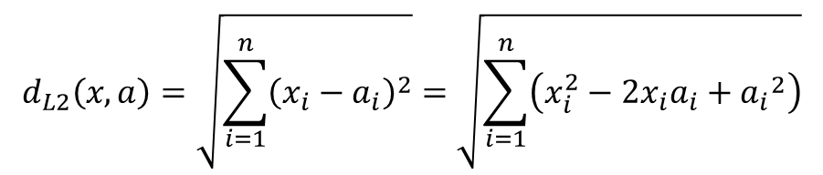

## kNN Classifier from Scratch

#### In this project, we build the kNN algorithm from scratch and implement the classifier on the fashion-MNIST dataset.

 

Feel free to learn more about the fashion-MNIST dataset at https://github.com/zalandoresearch/fashion-mnist  

In this project, we developed the kNN classifier using two different Squared Euclidean distance formulae :

- Version 1: One loop with broadcast, time: ~1521.68 seconds
- Version 2: Leverage vectorization, time: ~116.24 seconds ( x 9.8 times faster)
  

Our kNN classifier manages to predict images up to ~ 85% accuracy (when k = 3 - 6).

